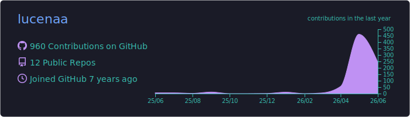
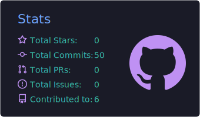
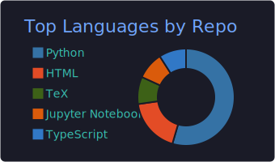

  

<h1 align="center">Gabriel Lucena</h1>

  <i>Computer Engineer — Instituto Tecnológico de Aeronáutica (ITA)</i>

  
  

---

### What I work on

- AI-driven products, from strategy to production
- LLM-based agent systems: orchestration, evals, deployment
- Technical decisions at the intersection of product and engineering

---

### Tech Stack

<b>Languages & Infrastructure</b>

  
  
  
  
  
  
  

<b>Machine Learning & AI</b>

  
  
  
  
  
  
  
  
  

<b>AI-Native Development</b>

  
  
  

<i>Spec-driven workflows · agent orchestration · end-to-end delivery</i>

---

### GitHub

  

  
  

